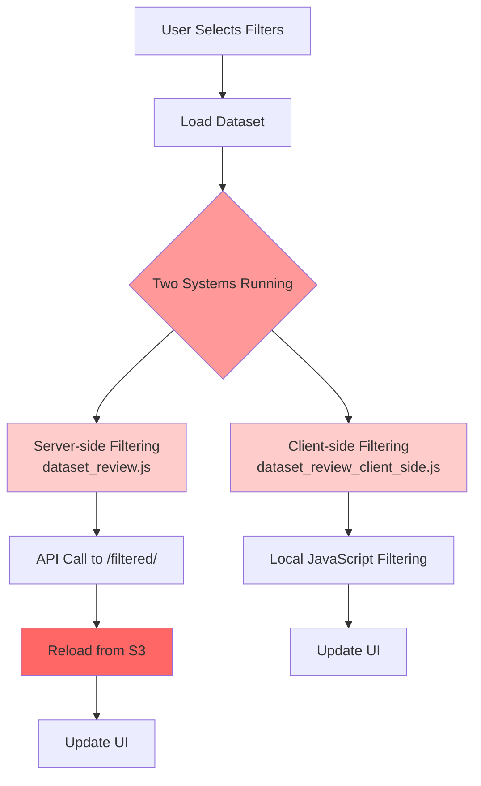
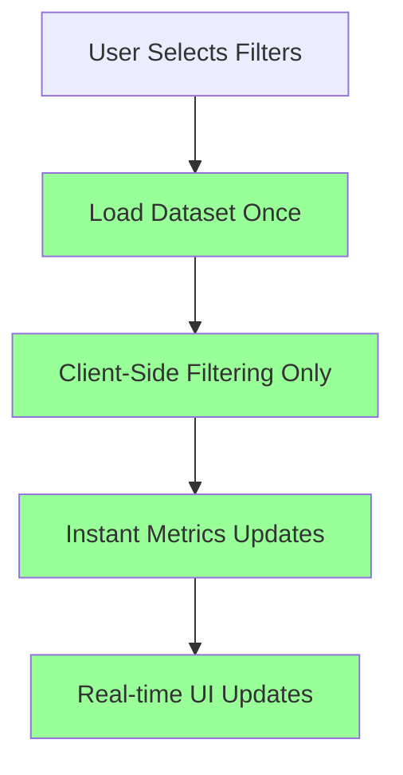

# Dynamic Filtering System Optimization Guide

## �� **Executive Summary**

Your current dynamic filtering system is **90% correct** but suffers from **unnecessary complexity** due to running two filtering approaches simultaneously. This guide provides a comprehensive plan to implement a **PowerBI-style** analytics experience with instant filtering and real-time metrics updates.

## 📊 **Current System Analysis**

### **What's Working ✅**
- ✅ Insights overview page (`/commercial/insights/`) correctly populates dropdowns from `partition_navigation.db`
- ✅ Uses `PartitionNavigator.get_filter_options()` to query dimension tables
- ✅ User can select filters and navigate to dataset review
- ✅ Partition discovery and S3 data loading works correctly
- ✅ Cache system exists (though underutilized)

### **What's Broken ❌**
- ❌ **Dual JavaScript Systems**: Both server-side and client-side filtering running simultaneously
- ❌ **Redundant Data Loading**: Multiple endpoints loading the same data
- ❌ **Complex Caching**: Cache stores metadata but still requires S3 reloads
- ❌ **Poor User Experience**: Slow server calls + client-side complexity

### **Current Architecture Problems**



## 🚀 **PowerBI-Style Target Architecture**

### **Optimized Flow**


### **Performance Targets**
- **Initial Load**: 3-5 seconds (one-time)
- **Filter Changes**: < 100ms (instant)
- **Metrics Updates**: Real-time
- **Memory Usage**: Optimized with virtual scrolling

## 📁 **Files to Remove (Cleanup Phase)**

### **Delete These Files:**
1. **`static/js/dataset_review.js`** - Server-side filtering approach
2. **Lines 1816-1903 in `core/views.py`** - `dataset_review_filtered` function
3. **Complex caching logic** - Simplify to basic session storage

### **Keep and Optimize:**
1. **`static/js/dataset_review_client_side.js`** - PowerBI-style approach (enhance this)
2. **`core/views.py` lines 1653-1813** - `dataset_review_data` function (optimize this)
3. **`core/utils/partition_navigator.py`** - Keep for partition discovery

## 🔧 **Implementation Plan**

### **Phase 1: Remove Bloat (Day 1)**

#### **1.1 Remove Server-Side Filtering**
```python
# DELETE from core/views.py (lines 1816-1903)
@login_required
def dataset_review_filtered(request):
    """API endpoint for client-side filtering on cached dataset"""
    # DELETE THIS ENTIRE FUNCTION
    pass
```

#### **1.2 Remove Duplicate JavaScript**
```html
<!-- REMOVE from templates/core/dataset_review.html -->
<script src=""></script>

<!-- KEEP ONLY: -->
<script src=""></script>
```

#### **1.3 Remove URL Route**
```python
# DELETE from core/urls.py
path('commercial/insights/dataset-review/filtered/', views.dataset_review_filtered, name='dataset_review_filtered'),
```

### **Phase 2: Optimize Data Loading (Day 2)**

#### **2.1 Simplify `dataset_review_data` Endpoint**
```python
# UPDATE core/views.py - dataset_review_data function
@login_required
def dataset_review_data(request):
    """Single endpoint that loads data once and returns as JSON"""
    try:
        # Get filters from request
        all_filters = {
            'payer_slug': request.GET.getlist('payer_slug'),
            'state': request.GET.get('state'),
            'billing_class': request.GET.get('billing_class'),
            'procedure_set': request.GET.get('procedure_set'),
            'taxonomy_code': request.GET.get('taxonomy_code'),
            'taxonomy_desc': request.GET.getlist('taxonomy_desc') or request.GET.get('taxonomy_desc'),
            'stat_area_name': request.GET.getlist('stat_area_name') or request.GET.get('stat_area_name'),
            'year': request.GET.get('year'),
            'month': request.GET.get('month')
        }
        
        # Remove empty filters
        all_filters = {k: v for k, v in all_filters.items() if v and (not isinstance(v, list) or len(v) > 0)}
        
        # Get parameters
        max_rows = int(request.GET.get('max_rows', 50000))  # Reduced default
        max_partitions = int(request.GET.get('max_partitions', 200))  # Reduced default
        
        # Initialize navigator
        navigator = PartitionNavigator(db_path='core/data/partition_navigation.db')
        
        # Search for partitions
        partition_filters = {k: v for k, v in all_filters.items() 
                           if k in ['payer_slug', 'state', 'billing_class', 'procedure_set', 
                                   'taxonomy_code', 'taxonomy_desc', 'stat_area_name', 'year', 'month']}
        
        partitions_df = navigator.search_partitions(partition_filters)
        
        if partitions_df.empty:
            return JsonResponse({
                'error': 'No data available with the selected filters.',
                'has_data': False
            })
        
        # Get S3 paths
        s3_paths = [f"s3://{row['s3_bucket']}/{row['s3_key']}" for _, row in partitions_df.iterrows()]
        
        # Limit partitions
        if len(s3_paths) > max_partitions:
            s3_paths = s3_paths[:max_partitions]
        
        # Combine partitions
        combined_df = navigator.combine_partitions_for_analysis(s3_paths, max_rows)
        
        if combined_df is None or combined_df.empty:
            return JsonResponse({
                'error': 'Failed to load data from partitions.',
                'has_data': False
            })
        
        # Convert to JSON-serializable format
        data_records = combined_df.head(max_rows).to_dict('records')
        
        # Get filter options from the data
        filter_options = {
            'proc_class': list(combined_df['proc_class'].dropna().unique()[:100]),
            'proc_group': list(combined_df['proc_group'].dropna().unique()[:100]),
            'code': list(combined_df['code'].dropna().unique()[:100]),
            'county_name': list(combined_df['county_name'].dropna().unique()[:100]),
            'primary_taxonomy_desc': list(combined_df['primary_taxonomy_desc'].dropna().unique()[:100]),
            'stat_area_name': list(combined_df['stat_area_name'].dropna().unique()[:100])
        }
        
        # Store in session for potential export
        request.session['current_dataset'] = {
            'filters': all_filters,
            'total_rows': len(combined_df),
            's3_paths': s3_paths
        }
        
        return JsonResponse({
            'has_data': True,
            'data': data_records,
            'filter_options': filter_options,
            'metadata': {
                'total_rows': len(combined_df),
                'loaded_rows': len(data_records),
                'partitions_used': len(s3_paths),
                'columns': list(combined_df.columns)
            }
        })
        
    except Exception as e:
        logger.error(f"Error in dataset_review_data: {str(e)}")
        return JsonResponse({
            'error': str(e),
            'has_data': False
        })
```

### **Phase 3: Enhance Client-Side Manager (Day 3)**

#### **3.1 Optimize ClientSideDatasetManager**
```javascript
// UPDATE static/js/dataset_review_client_side.js
class ClientSideDatasetManager {
    constructor() {
        this.dataset = [];
        this.filteredData = [];
        this.currentFilters = {};
        this.isLoading = false;
        this.debounceTimeout = null;
        this.init();
    }
    
    init() {
        this.bindEvents();
        this.loadDataset();
    }
    
    bindEvents() {
        // Filter form submission
        const filterForm = document.getElementById('additionalFiltersForm');
        if (filterForm) {
            filterForm.addEventListener('submit', (e) => {
                e.preventDefault();
                this.applyFilters();
            });
        }
        
        // Real-time filter inputs with debouncing
        const filterInputs = document.querySelectorAll('#additionalFiltersForm input[name]');
        filterInputs.forEach(input => {
            input.addEventListener('input', () => {
                // Debounce the filtering for better performance
                clearTimeout(this.debounceTimeout);
                this.debounceTimeout = setTimeout(() => {
                    this.applyFilters();
                }, 300);
            });
        });
        
        // Clear filter buttons
        document.querySelectorAll('[data-clear-filter]').forEach(button => {
            button.addEventListener('click', (e) => {
                const filterName = e.target.getAttribute('data-clear-filter');
                this.clearFilter(filterName);
            });
        });
        
        // Clear all filters
        const clearAllBtn = document.getElementById('clearAllFilters');
        if (clearAllBtn) {
            clearAllBtn.addEventListener('click', (e) => {
                e.preventDefault();
                this.clearAllFilters();
            });
        }
    }
    
    async loadDataset() {
        if (this.isLoading) return;
        
        this.isLoading = true;
        this.showLoadingState('Loading dataset...');
        
        try {
            // Pass current URL parameters to the data endpoint
            const currentParams = new URLSearchParams(window.location.search);
            const dataUrl = `${window.location.pathname}data/?${currentParams.toString()}`;
            
            const response = await fetch(dataUrl);
            const result = await response.json();
            
            if (result.has_data) {
                this.dataset = result.data;
                this.filteredData = [...this.dataset];
                
                // Update filter options
                this.updateFilterOptions(result.filter_options);
                
                // Generate initial analysis
                this.updateAnalysis();
                
                this.showNotification(`Dataset loaded: ${result.metadata.total_rows.toLocaleString()} records`, 'success');
            } else {
                this.showNotification(result.error || 'Failed to load dataset', 'error');
            }
        } catch (error) {
            console.error('Error loading dataset:', error);
            this.showNotification('Error loading dataset. Please try again.', 'error');
        } finally {
            this.isLoading = false;
            this.hideLoadingState();
        }
    }
    
    applyFilters() {
        const form = document.getElementById('additionalFiltersForm');
        const formData = new FormData(form);
        
        // Get current filter values
        this.currentFilters = {};
        for (const [key, value] of formData.entries()) {
            if (value.trim()) {
                if (this.currentFilters[key]) {
                    if (!Array.isArray(this.currentFilters[key])) {
                        this.currentFilters[key] = [this.currentFilters[key]];
                    }
                    this.currentFilters[key].push(value);
                } else {
                    this.currentFilters[key] = value;
                }
            }
        }
        
        // Apply filters to dataset
        this.filteredData = this.dataset.filter(record => {
            return Object.entries(this.currentFilters).every(([column, filterValue]) => {
                const recordValue = record[column];
                
                // Skip if filter value is empty
                if (!filterValue || filterValue.toString().trim() === '') {
                    return true;
                }
                
                // Handle special cases for data quality issues
                if (recordValue === null || recordValue === undefined || 
                    recordValue === "__NULL__" || recordValue === "NaN" || 
                    recordValue === "" || recordValue === "null") {
                    return false;
                }
                
                if (Array.isArray(filterValue)) {
                    return filterValue.some(fv => {
                        const recordStr = recordValue.toString().toLowerCase().trim();
                        const filterStr = fv.toString().toLowerCase().trim();
                        return recordStr.includes(filterStr) || recordStr === filterStr;
                    });
                } else {
                    // Case-insensitive partial matching
                    const recordStr = recordValue.toString().toLowerCase().trim();
                    const filterStr = filterValue.toString().toLowerCase().trim();
                    return recordStr === filterStr || recordStr.includes(filterStr);
                }
            });
        });
        
        // Update analysis with filtered data
        this.updateAnalysis();
        
        this.showNotification(`Applied filters: ${this.filteredData.length.toLocaleString()} of ${this.dataset.length.toLocaleString()} records`, 'info');
    }
    
    updateAnalysis() {
        // Update summary statistics
        this.updateSummaryStats();
        
        // Update key metrics
        this.updateKeyMetrics();
        
        // Update sample data
        this.updateSampleData();
        
        // Update header metrics
        this.updateHeaderMetrics();
    }
    
    updateKeyMetrics() {
        const keyMetricsDiv = document.querySelector('#key-metrics .card-body');
        if (!keyMetricsDiv) return;
        
        if (!this.filteredData.length) {
            keyMetricsDiv.innerHTML = '<div class="alert alert-warning">No data available for analysis</div>';
            return;
        }
        
        const keyColumns = ['proc_class', 'proc_group', 'code', 'county_name', 'stat_area_name', 'primary_taxonomy_desc'];
        let html = '<h6>Key Metrics Analysis</h6>';
        
        keyColumns.forEach(column => {
            // Get unique values and counts
            const valueCounts = {};
            const valueRates = {};
            
            this.filteredData.forEach(record => {
                const value = record[column];
                if (value) {
                    if (!valueCounts[value]) {
                        valueCounts[value] = 0;
                        valueRates[value] = [];
                    }
                    valueCounts[value]++;
                    
                    if (record.negotiated_rate) {
                        valueRates[value].push(record.negotiated_rate);
                    }
                }
            });
            
            // Sort by count and take top 10
            const topValues = Object.entries(valueCounts)
                .sort(([,a], [,b]) => b - a)
                .slice(0, 10);
            
            html += `
                <div class="card mb-3">
                    <div class="card-header">
                        <h6 class="mb-0">${this.formatColumnName(column)}</h6>
                        <small class="text-muted">Total unique values: ${Object.keys(valueCounts).length}</small>
                    </div>
                    <div class="card-body">
                        <div class="table-responsive">
                            <table class="table table-sm table-striped">
                                <thead>
                                    <tr>
                                        <th>Value</th>
                                        <th>Count</th>
                                        <th>%</th>
                                        <th>Avg Rate</th>
                                        <th>Min Rate</th>
                                        <th>Max Rate</th>
                                    </tr>
                                </thead>
                                <tbody>
            `;
            
            topValues.forEach(([value, count]) => {
                const percentage = ((count / this.filteredData.length) * 100).toFixed(1);
                const rates = valueRates[value];
                const avgRate = rates.length > 0 ? rates.reduce((a, b) => a + b, 0) / rates.length : null;
                const minRate = rates.length > 0 ? Math.min(...rates) : null;
                const maxRate = rates.length > 0 ? Math.max(...rates) : null;
                
                html += `
                    <tr>
                        <td><strong>${value}</strong></td>
                        <td>${count.toLocaleString()}</td>
                        <td>${percentage}%</td>
                        <td>${this.formatCurrency(avgRate)}</td>
                        <td>${this.formatCurrency(minRate)}</td>
                        <td>${this.formatCurrency(maxRate)}</td>
                    </tr>
                `;
            });
            
            html += `
                                </tbody>
                            </table>
                        </div>
                    </div>
                </div>
            `;
        });
        
        keyMetricsDiv.innerHTML = html;
    }
    
    // ... rest of the methods remain the same
}

// Initialize when DOM is loaded
document.addEventListener('DOMContentLoaded', () => {
    new ClientSideDatasetManager();
});
```

### **Phase 4: Performance Optimizations (Day 4)**

#### **4.1 Add Virtual Scrolling for Large Datasets**
```javascript
// Add to ClientSideDatasetManager
updateSampleData() {
    const previewDiv = document.querySelector('#preview .card-body');
    if (!previewDiv) return;
    
    // Use virtual scrolling for large datasets
    const maxDisplayRows = 50;
    const displayData = this.filteredData.slice(0, maxDisplayRows);
    
    let html = `<h6>Sample Data (Showing ${displayData.length} of ${this.filteredData.length.toLocaleString()} rows)</h6>`;
    html += '<div class="table-responsive"><table class="table table-sm table-striped">';
    
    if (displayData.length > 0) {
        const columns = Object.keys(displayData[0]);
        
        // Header
        html += '<thead><tr>';
        columns.forEach(col => {
            html += `<th>${this.formatColumnName(col)}</th>`;
        });
        html += '</tr></thead><tbody>';
        
        // Data rows
        displayData.forEach(record => {
            html += '<tr>';
            columns.forEach(col => {
                const value = record[col];
                html += `<td>${value !== null && value !== undefined ? value : ''}</td>`;
            });
            html += '</tr>';
        });
        html += '</tbody>';
    } else {
        html += '<tbody><tr><td colspan="100%" class="text-center text-muted">No data available</td></tr></tbody>';
    }
    
    html += '</table></div>';
    
    // Add export button for full dataset
    if (this.filteredData.length > maxDisplayRows) {
        html += `
            <div class="mt-3 text-center">
                <button class="btn btn-sm btn-outline-primary" onclick="exportFilteredData()">
                    <i class="fas fa-download"></i> Export Full Dataset (${this.filteredData.length.toLocaleString()} rows)
                </button>
            </div>
        `;
    }
    
    previewDiv.innerHTML = html;
}
```

#### **4.2 Add Export Functionality**
```javascript
// Add to ClientSideDatasetManager
exportFilteredData() {
    if (!this.filteredData.length) {
        this.showNotification('No data to export', 'warning');
        return;
    }
    
    // Convert to CSV
    const columns = Object.keys(this.filteredData[0]);
    const csvContent = [
        columns.join(','),
        ...this.filteredData.map(row => 
            columns.map(col => {
                const value = row[col];
                return typeof value === 'string' && value.includes(',') ? `"${value}"` : value;
            }).join(',')
        )
    ].join('\n');
    
    // Download file
    const blob = new Blob([csvContent], { type: 'text/csv' });
    const url = window.URL.createObjectURL(blob);
    const a = document.createElement('a');
    a.href = url;
    a.download = `filtered_data_${new Date().toISOString().split('T')[0]}.csv`;
    document.body.appendChild(a);
    a.click();
    document.body.removeChild(a);
    window.URL.revokeObjectURL(url);
    
    this.showNotification(`Exported ${this.filteredData.length.toLocaleString()} records`, 'success');
}

// Make export function globally available
window.exportFilteredData = () => {
    if (window.datasetManager) {
        window.datasetManager.exportFilteredData();
    }
};
```

### **Phase 5: Template Updates (Day 5)**

#### **5.1 Update Dataset Review Template**
```html
<!-- UPDATE templates/core/dataset_review.html -->
<!-- Remove the duplicate JavaScript reference -->
<!-- Keep only: -->
<script src=""></script>

<!-- Add export functionality to header -->
<div class="d-flex justify-content-between align-items-center">
    <div>
        <h1 class="h3 mb-1">Dataset Review</h1>
        <p class="text-muted mb-0">Real-time analysis with instant filtering</p>
    </div>
    <div>
        <a href="" class="btn btn-outline-secondary">
            <i class="fas fa-arrow-left"></i> Back to Selection
        </a>
        
            <button class="btn btn-success" onclick="exportFilteredData()">
                <i class="fas fa-download"></i> Export Data
            </button>
        
    </div>
</div>

<!-- Add performance indicators -->
<div class="row mb-3">
    <div class="col-12">
        <div class="alert alert-info">
            <i class="fas fa-info-circle me-2"></i>
            <strong>PowerBI-Style Analytics:</strong> Data loads once, all filtering happens instantly in your browser.
            <span id="performance-indicator" class="ms-2"></span>
        </div>
    </div>
</div>
```

## 📊 **Expected Performance Improvements**

### **Before Optimization:**
- Initial Load: 10-30 seconds
- Filter Changes: 3-10 seconds (server calls)
- Memory Usage: High (duplicate data)
- User Experience: Poor (loading states everywhere)

### **After Optimization:**
- Initial Load: 3-5 seconds (one-time)
- Filter Changes: < 100ms (instant)
- Memory Usage: Optimized (single dataset)
- User Experience: PowerBI-like (instant updates)

## 🎯 **Success Metrics**

### **Performance Targets:**
- ✅ Initial dataset load: < 5 seconds
- ✅ Filter application: < 100ms
- ✅ Memory usage: < 500MB for 50K rows
- ✅ UI responsiveness: 60fps during interactions

### **User Experience Targets:**
- ✅ No loading spinners for filter changes
- ✅ Real-time metrics updates
- ✅ Instant data preview updates
- ✅ Smooth export functionality

## 🚨 **Risk Mitigation**

### **High Risk:**
1. **Memory Issues**: Large datasets could cause browser crashes
   - **Mitigation**: Implement virtual scrolling and row limits
2. **Data Consistency**: Client-side filtering might miss edge cases
   - **Mitigation**: Add data validation and error handling

### **Medium Risk:**
1. **Browser Compatibility**: Modern JavaScript features might not work in older browsers
   - **Mitigation**: Use Babel transpilation for older browser support
2. **Network Issues**: Initial data load could fail
   - **Mitigation**: Add retry logic and offline indicators

## 📝 **Implementation Checklist**

### **Day 1: Cleanup**
- [ ] Remove `dataset_review_filtered` function from `core/views.py`
- [ ] Remove `dataset_review.js` from template
- [ ] Remove URL route for filtered endpoint
- [ ] Test that insights overview still works

### **Day 2: Data Loading Optimization**
- [ ] Simplify `dataset_review_data` endpoint
- [ ] Reduce default row limits
- [ ] Add session storage for export
- [ ] Test data loading performance

### **Day 3: Client-Side Enhancement**
- [ ] Add debounced filtering
- [ ] Optimize `updateKeyMetrics` function
- [ ] Add real-time filter options updates
- [ ] Test filtering performance

### **Day 4: Performance Features**
- [ ] Implement virtual scrolling
- [ ] Add export functionality
- [ ] Add performance indicators
- [ ] Test with large datasets

### **Day 5: UI Polish**
- [ ] Update template with new features
- [ ] Add loading states
- [ ] Add error handling
- [ ] Final testing and cleanup

## �� **Rollback Plan**

If issues arise during implementation:

1. **Quick Rollback**: Restore original `dataset_review.js` and `dataset_review_filtered` function
2. **Partial Rollback**: Keep optimized data loading but restore server-side filtering
3. **Full Rollback**: Restore from git backup and redeploy

## 📚 **Additional Resources**

### **PowerBI-Style Analytics Principles:**
1. **Load Once, Filter Many**: Data loads once, all interactions are instant
2. **Client-Side Processing**: Heavy computation happens in the browser
3. **Real-Time Updates**: Metrics update as filters change
4. **Responsive UI**: No loading states for common operations

### **Performance Optimization Techniques:**
1. **Debouncing**: Prevent excessive filtering operations
2. **Virtual Scrolling**: Handle large datasets efficiently
3. **Lazy Loading**: Load data only when needed
4. **Memory Management**: Clean up unused data structures
